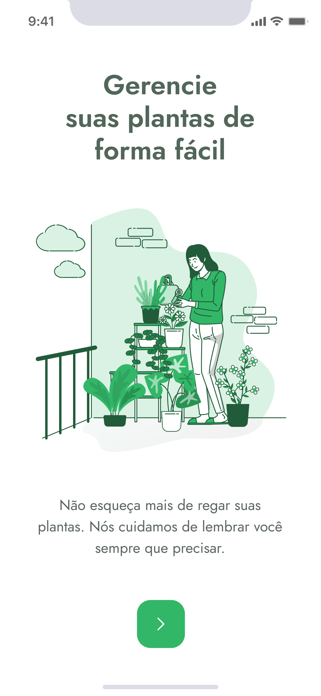

# PlantManager

App desenvolvido em React-Native com foco em gerenciamento de plantas, o aplicativo encarrega de cadastrar as plantas do
usuário e categorizá-las por ambiente adequado para cuidados, apresentação das melhores formas de cuidado para cada espécie do usuário,
além dos intervalos de regação e formas corretas de regar. O app também se encarrega de noticar o device do usuário quando for o momento de cuidar para cada planta.


#Formas de usar

Para iniciar o App:
```
expo start
```

Para iniciar o servidor da api interna:
```
server-json ./src/services/server.json --host {seu ip} --port 3333 --delay 700
```

O delay de 700 é para possibilitar a visualização da animação de loading entr páginas.

#Tecnologias usadas

&nbsp;


# Screens
<details>
<summary>Mobile📱</summary>
  



</details>

